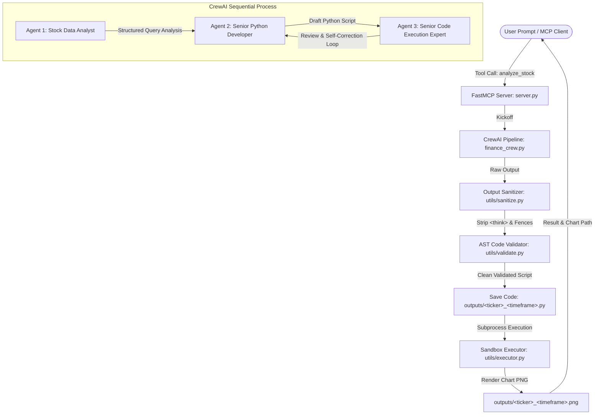

# AI Financial Analyst Agent

> Autonomous multi-agent stock research and visualization engine powered by **CrewAI**, **FastMCP**, **yfinance**, and local open-weight LLMs (**DeepSeek-R1 / Ollama**).

[](https://www.python.org/)
[](https://opensource.org/licenses/MIT)
[](https://modelcontextprotocol.io/)
[](https://crewai.com)

---

## 1. Overview

Retrieving, analyzing, and visualizing stock market data usually requires manually writing Python scripts, juggling `yfinance` and `matplotlib` parameters, and debugging code execution. 

The **AI Financial Analyst Agent** accepts natural language queries (such as *"Show me Tesla's YTD performance"* or *"Compare Apple and Microsoft stocks for the past year"*) and autonomously:
1. **Parses** ticker symbols, timeframes, and actions into structured Pydantic schemas.
2. **Generates** clean, production-ready Python visualization scripts using `yfinance` and `matplotlib`.
3. **Validates & executes** the generated code in a sandboxed subprocess with strict timeouts and error handling.
4. **Exposes** the entire pipeline as standard **MCP (Model Context Protocol)** tools ready for **Claude Desktop** and **Claude Code**.

---

## 2. Architecture



### Agent Roles

| Agent | Role | Responsibility | Output |
|---|---|---|---|
| **Query Parser** | Stock Data Analyst | Extracts ticker symbol(s), validates timeframes, determines action. | `QueryAnalysisOutput` (Pydantic) |
| **Code Writer** | Senior Python Developer | Writes self-contained Python scripts targeting `yf.download` and `plt.savefig`. | Python code string |
| **Code Executor** | Code Execution Expert | Reviews code, ensures imports and file saving syntax are valid. | Working script |

---

## 3. Key Hardening Features

- **Output Sanitization Layer:** DeepSeek-R1 reasoning models emit `<think>...</think>` blocks and markdown fences. `utils/sanitize.py` strips reasoning traces and extracts clean Python code before execution.
- **AST Syntax Validation:** All scripts are parsed via `ast.parse()` prior to disk persistence or execution, preventing syntax errors and invalid f-strings.
- **Subprocess Sandbox Execution:** Replaced unsafe in-process `exec()` with isolated `subprocess.run([python, script], timeout=30, capture_output=True)`.
- **Bounded Retry Loop:** Agent delegation and re-generation are strictly bounded to a maximum of 3 attempts with human-readable error messages.
- **Multi-LLM Provider Support:** Run blazing fast in the cloud with **Groq** (`llama-3.3-70b-versatile` or `deepseek-r1-distill-llama-70b`), 100% free locally with **Ollama** (`deepseek-r1:7b`), or cloud **OpenAI** (`gpt-4o`) via `.env`.

---

## 4. Getting Started

### Prerequisites

1. **Python 3.12+**
2. **Ollama** installed and running:
   ```bash
   ollama pull deepseek-r1:7b
   ollama serve
   ```

### Installation

1. Clone the repository and enter the directory:
   ```bash
   git clone https://github.com/morid648/ai-stock-analyst.git
   cd ai-stock-analyst
   ```

2. Create and activate a virtual environment:
   ```bash
   python -m venv .venv
   # Windows PowerShell:
   .\.venv\Scripts\Activate.ps1
   # macOS / Linux:
   source .venv/bin/activate
   ```

3. Install dependencies:
   ```bash
   pip install -r requirements.txt
   ```

4. Configure environment variables:
   ```bash
   cp .env.example .env
   ```
   Edit `.env` if you wish to change the LLM provider, Ollama base URL, or logging level.

---

## 5. Usage

### A. Running as an MCP Server (Claude Desktop / Claude Code)

Run the server over stdio transport:
```bash
python server.py
```

To connect to **Claude Desktop**, add the server to your `claude_desktop_config.json`:

```json
{
  "mcpServers": {
    "financial-analyst": {
      "command": "<path-to-repo>\\.venv\\Scripts\\python.exe",
      "args": [
        "<path-to-repo>\\server.py"
      ],
      "cwd": "<path-to-repo>"
    }
  }
}
```

Replace `<path-to-repo>` with the absolute path where you cloned this repo.

#### Available MCP Tools

1. **`analyze_stock(query: str)`**: Converts natural language financial requests into validated Python analysis scripts.
2. **`save_code(code: str, filename: Optional[str] = None)`**: Validates AST and saves script to `outputs/`.
3. **`run_code_and_show_plot(script_path: Optional[str] = None)`**: Safely executes the script and produces the `.png` chart.
4. **`list_saved_analyses()`**: Lists all historical scripts and charts generated.

---

### B. Running as a CLI Script

You can run the multi-agent crew directly:
```bash
python finance_crew.py
```

---

### C. Running the Streamlit Web Application

Launch the interactive dashboard in your browser:
```bash
streamlit run app.py
```
This starts a local web server (typically at `http://localhost:8501`) featuring natural language query input, real-time agent code generation, sandboxed chart execution, and a historical gallery of previous analyses.

---

## 6. Running Tests

The test suite includes 61 unit and integration tests covering sanitization, AST validation, subprocess execution, timeout handling, file persistence, MCP tools, and the Streamlit web app:

```bash
pytest -v
```

---

## 7. Known Limitations & Roadmap

- **Indian Tickers (NSE/BSE):** Yahoo Finance requires `.NS` or `.BO` suffixes (e.g. `RELIANCE.NS`). Future versions will support automatic suffix detection.
- **Rate Limits:** Intensive query bursts may be rate-limited by Yahoo Finance. A local SQLite/Parquet caching layer is planned.
- **Fundamentals Agent:** A 4th agent pulling P/E, EPS, and market capitalization alongside price charts is planned for v1.1.

---

## 8. License

This project is licensed under the [MIT License](LICENSE).
